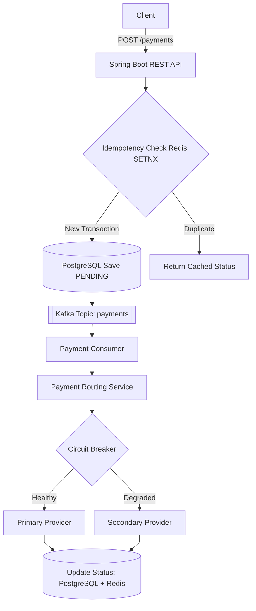
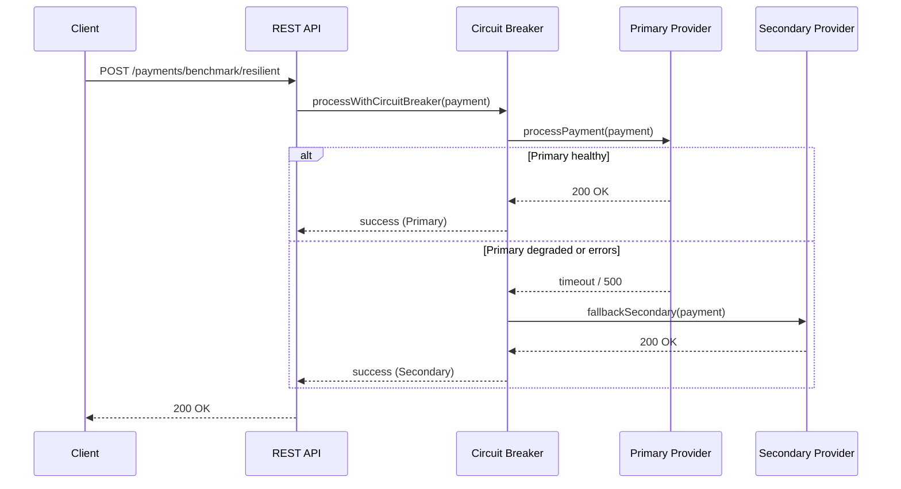

# Resilient Payment Gateway
A distributed payment processing backend that stays available and correct when a downstream payment provider degrades or fails — built with Java, Spring Boot, Kafka, Redis, and Resilience4j.
 
## The Problem
 
Every payment platform depends on a third-party processor (Stripe, Adyen, etc.) that can time out, throttle, or go down entirely. A naive integration lets that outage become the customer's problem: failed checkouts, lost revenue, and duplicate charges when retries aren't handled safely.
 
This project builds a payment gateway that detects a degrading provider automatically, reroutes live traffic to a healthy secondary provider before customers notice, and guarantees each transaction is processed exactly once — even under Kafka retries and concurrent duplicate requests.

## Architecture

The diagram above shows the system's components and how data moves between them. The sequence below zooms into a single request, showing exactly what happens in the few hundred milliseconds after a payment is submitted - specifically, how the circuit breaker decides whether to trust the primary provider or reroute instantly to the secondary

### Failover Flow
 

## Key Engineering Highlights
 
- **Idempotent request handling** — Redis `SETNX` guarantees a duplicate submission of the same transaction ID is never double-processed, even under concurrent retries.
- **Event-driven, ordered processing** — Kafka partitions by transaction ID, so every status update for a given payment is processed in order on the same partition.
- **Automatic failover** — a Resilience4j circuit breaker wraps the primary provider call; on repeated failures or slow responses, traffic reroutes to a secondary provider without the caller ever seeing an error.
- **Cache-aside status lookups** — payment status reads hit Redis first, falling back to PostgreSQL (and repopulating the cache) if the entry has expired or was never cached.
## Benchmark: Baseline vs. Resilient
 
Load tested with [`hey`](https://github.com/rakyll/hey) (100 requests, concurrency 10) against a primary provider configured to fail ~15% of the time with a 2s hang before erroring.
 
| Metric | Baseline (single provider) | Resilient (circuit breaker + failover) |
|---|---|---|
| Successful responses | 89 / 100 | **100 / 100** |
| Failed responses (500) | 11 | **0** |
| Requests/sec | 18.56 | 19.41 |
| p50 latency | 158 ms | 109 ms |
| p90 latency | 2.00 s | 2.11 s |
| p99 latency | 2.10 s | 2.13 s |
 
The resilient path recovers every transaction the baseline would have dropped, with no successful requests lost to a degraded provider.
 
> **Note:** at this failure rate and sliding-window size, the circuit breaker's per-request fallback is doing the recovery work — the breaker itself stays CLOSED because failures don't cross the 50% threshold within a 10-request window. A higher sustained failure rate is needed to observe the breaker fully OPEN and skip the primary entirely (see Roadmap).
 
## Tech Stack
 
| Layer | Technology |
|---|---|
| Language | Java 21 |
| Framework | Spring Boot 4 |
| Messaging | Apache Kafka |
| Cache | Redis |
| Database | PostgreSQL |
| Resilience | Resilience4j (Circuit Breaker) |
| Containerization | Docker Compose |
| Load Testing | hey |
 
## Getting Started
 
```bash
# Start Postgres, Redis, and Kafka
docker-compose up -d
 
# Run the application
./mvnw spring-boot:run
```
 
Initiate a payment (async, via Kafka):
```bash
curl -X POST http://localhost:8080/api/v1/payments \
  -H "Content-Type: application/json" \
  -d '{"transactionId":"txn-001","userEmail":"user@example.com","amount":49.99,"currency":"USD"}'
```
 
Check status:
```bash
curl http://localhost:8080/api/v1/payments/txn-001
```
 
Run the baseline vs. resilient benchmark directly:
```bash
curl -X POST http://localhost:8080/api/v1/payments/benchmark/baseline -H "Content-Type: application/json" -d '{"transactionId":"bench-001"}'
curl -X POST http://localhost:8080/api/v1/payments/benchmark/resilient -H "Content-Type: application/json" -d '{"transactionId":"bench-002"}'
```
 
## Project Structure
 
```
src/main/java/com/pay/paymentgateway/
├── config/
├── consumer/        → Kafka consumer, drives the routing decision
├── controller/       → REST endpoints
├── dto/               → ProviderResponse
├── entity/            → Payment, PaymentStatus
├── provider/          → PaymentProvider interface, Primary/Secondary implementations
├── repository/        → PaymentRepository (JPA)
└── service/            → PaymentService (idempotency + Kafka), PaymentRoutingService (circuit breaker)
```
 
## Roadmap
 
- [ ] Transactional Outbox pattern for guaranteed, exactly-once Kafka publishing (closing the dual-write gap between the DB save and the Kafka send)
- [ ] Enforced payment state machine (e.g., blocking a refund on a `PENDING` or `DECLINED` transaction)
- [ ] Spring Boot Actuator integration to expose live circuit-breaker state
- [ ] Higher-volume load testing to trigger and observe the circuit breaker's OPEN state directly
## License
 
MIT
